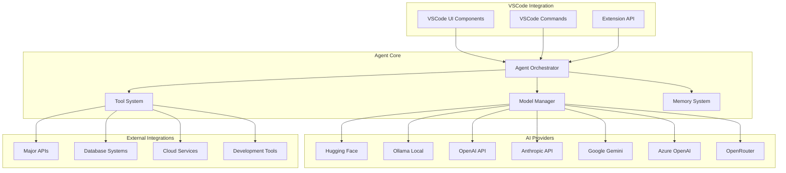

# VSCode AI Agent System Architecture

## Overview

This document outlines the architecture for integrating a world-class AI coding agent system into VSCode, leveraging multiple AI repositories and technologies to create a comprehensive development assistant.

## Core Components

### 1. Agent Orchestrator (`agent-orchestrator.ts`)
**Purpose**: Central coordination system that manages all agent operations
**Responsibilities**:
- Route requests to appropriate AI models/providers
- Manage conversation context and memory
- Coordinate between different agent capabilities
- Handle API rate limiting and error recovery
- Provide unified interface for all agent operations

### 2. Model Manager (`model-manager.ts`)
**Purpose**: Manages multiple AI model providers and local models
**Supported Providers**:
- **Hugging Face Transformers**: Primary model system with model switching
- **Ollama**: Local model execution and management
- **OpenAI**: GPT-4, GPT-3.5-turbo
- **Anthropic**: Claude models
- **Google**: Gemini models
- **Azure OpenAI**: Enterprise Azure deployments
- **OpenRouter**: Access to multiple model providers

### 3. Tool System (`tools/`)
**Purpose**: Extensible tool ecosystem for agent capabilities
**Core Tools**:
- **File Operations**: Read, write, edit, search files
- **Terminal Integration**: Execute shell commands
- **Code Analysis**: Parse, understand, and analyze code
- **Project Management**: Handle project structure and dependencies
- **Web Integration**: API calls, web scraping, documentation lookup
- **Database Operations**: Query and manipulate databases
- **Testing Framework**: Run tests, generate test cases
- **Debugging Assistant**: Analyze errors, suggest fixes

### 4. Memory & Knowledge System (`memory/`)
**Purpose**: Persistent knowledge storage and retrieval
**Components**:
- **GraphRAG Integration**: Knowledge graph for code understanding
- **AI Brainstore**: Persistent learning and context storage
- **Conversation History**: Maintain context across sessions
- **Project Knowledge**: Understand project structure and patterns

### 5. UI Integration (`ui/`)
**Purpose**: Seamless integration with VSCode interface
**Components**:
- **Chat Interface**: Conversational agent interaction
- **Status Indicators**: Agent activity and model status
- **Model Selector**: Switch between different AI models
- **Progress Tracking**: Show agent progress on complex tasks
- **Error Display**: Clear error reporting and suggestions

## Architecture Diagram



## Data Flow

### Request Processing Flow
1. **User Input** → VSCode Command/UI
2. **Request Routing** → Agent Orchestrator
3. **Model Selection** → Model Manager (based on task type, user preferences)
4. **Context Gathering** → Memory System (retrieve relevant knowledge)
5. **Tool Execution** → Tool System (if needed for task)
6. **AI Processing** → Selected Model Provider
7. **Response Generation** → Orchestrator processes and formats response
8. **UI Update** → Display results in VSCode interface

### Memory Management Flow
1. **Knowledge Ingestion** → Process codebases, documentation, conversations
2. **Graph Construction** → GraphRAG builds knowledge relationships
3. **Storage** → AI Brainstore persists learned patterns
4. **Retrieval** → Context-aware knowledge retrieval for tasks
5. **Learning** → Continuous improvement from user interactions

## Key Features

### Multi-Model Intelligence
- **Automatic Model Selection**: Choose optimal model based on task complexity
- **Model Switching**: Seamless switching between local and cloud models
- **Hybrid Processing**: Combine multiple models for complex tasks
- **Cost Optimization**: Balance between speed, cost, and quality

### Advanced Tool Integration
- **File System Operations**: Complete file manipulation capabilities
- **Terminal Integration**: Execute and monitor shell commands
- **Code Understanding**: Parse and analyze code across languages
- **Project Intelligence**: Understand project structure and dependencies
- **Testing Automation**: Generate and run comprehensive test suites

### Enterprise-Ready Features
- **Security**: API key management, data encryption, audit trails
- **Scalability**: Handle large codebases and complex projects
- **Performance**: Optimized inference and caching strategies
- **Monitoring**: Comprehensive logging and performance metrics
- **Compliance**: Enterprise security and compliance features

## Integration Points

### VSCode Extension Points
- **Commands**: Agent activation and control commands
- **Menus**: Context menu integration for agent actions
- **Status Bar**: Agent status and quick actions
- **Settings**: Comprehensive configuration options
- **Keybindings**: Customizable keyboard shortcuts

### Development Workflow Integration
- **Code Completion**: AI-powered intelligent code completion
- **Code Review**: Automated code review and suggestions
- **Debugging**: AI-assisted debugging and error resolution
- **Refactoring**: Intelligent code refactoring suggestions
- **Documentation**: Automatic documentation generation

## Configuration System

### Model Configuration
```json
{
  "agent.models": {
    "default": "huggingface",
    "providers": {
      "huggingface": {
        "models": ["codellama", "starcoder", "deepseek-coder"],
        "defaultModel": "codellama"
      },
      "ollama": {
        "endpoint": "http://localhost:11434",
        "models": ["codellama:7b", "codellama:13b"]
      }
    }
  }
}
```

### Tool Configuration
```json
{
  "agent.tools": {
    "enabled": ["fileops", "terminal", "search", "testing"],
    "fileops": {
      "maxFileSize": "10MB",
      "allowedExtensions": ["*"]
    },
    "terminal": {
      "timeout": 30000,
      "workingDirectory": "${workspaceFolder}"
    }
  }
}
```

## Security Considerations

### API Key Management
- Secure storage of API keys using VSCode's secret storage
- Environment variable support for CI/CD pipelines
- Key rotation and expiration handling

### Data Privacy
- Local processing options for sensitive code
- Data anonymization for cloud processing
- User consent for data sharing

### Access Control
- Workspace-level permissions
- Command restrictions based on user roles
- Audit logging for all agent actions

## Performance Optimization

### Caching Strategies
- Response caching for repeated queries
- Model output caching
- Knowledge graph caching

### Resource Management
- Model warm-up and preloading
- Memory usage optimization
- Background processing for heavy tasks

### Monitoring and Metrics
- Response time tracking
- Token usage monitoring
- Error rate analysis
- User satisfaction metrics

## Future Enhancements

### Advanced Capabilities
- Multi-agent collaboration
- Custom model fine-tuning
- Voice interaction
- Real-time pair programming
- Automated deployment pipelines

### Ecosystem Integration
- GitHub Copilot integration
- CI/CD pipeline integration
- Container and Kubernetes support
- Cloud platform integration

This architecture provides a solid foundation for building a world-class AI coding agent that seamlessly integrates with VSCode while leveraging the power of multiple AI technologies and repositories.